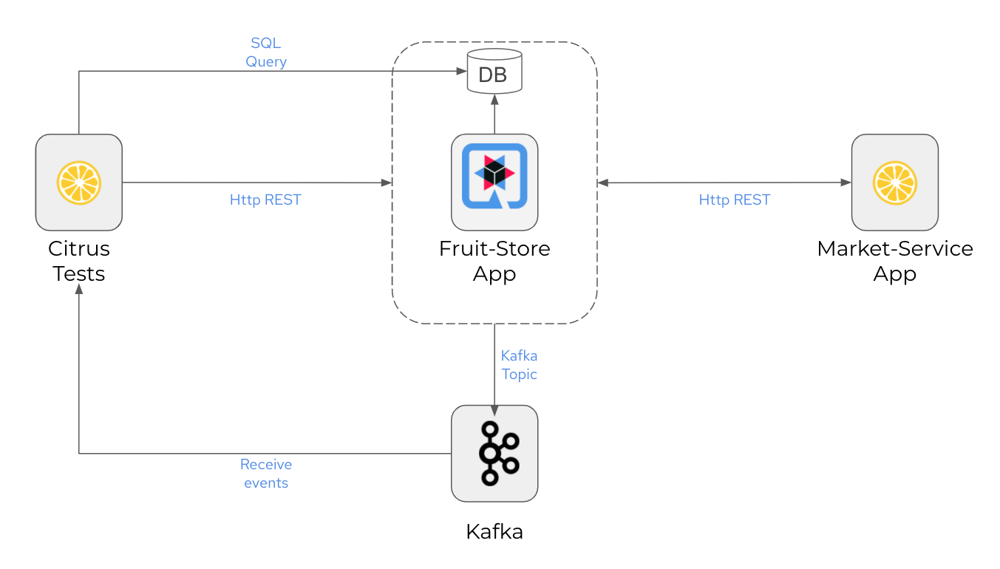

# "Integration testing with a Citrus twist" Demo

This repository represents the demo for the talk "Integration testing with a Citrus twist". 

The demo shows how to write automated integration tests with Citrus framework. The System Under Test (SUT) in this sample 
is a Quarkus web application that exposes a Http REST Open API service. The automated integration tests
written with [Citrus](https://github.com/citrusframework/citrus) verify the messaging interfaces with different 
messaging transports(Http REST & Kakfa) including the persistence layer (PostgresSQL). 



# Setup

The tests use a Quarkus web application as SUT (System Under Test). We need to start the application first before running any test.

You can run the OpenAPI fruit-store web application as follows:

```shell script
$ ./mvnw -pl :fruit-store quarkus:dev
```                             

This runs the fruit-store service and exposes the Http REST API at [http://localhost:8080](http://localhost:8080).

# Run Citrus tests

```shell script
$ ./mvnw -pl :citrus-test verify
```
